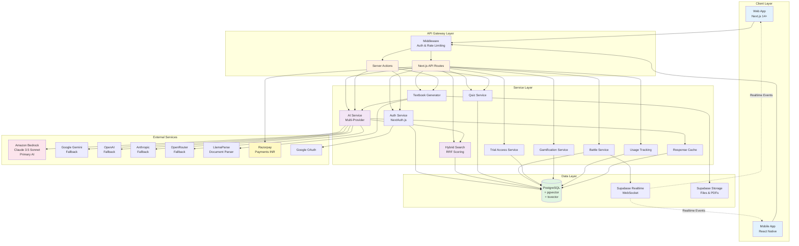
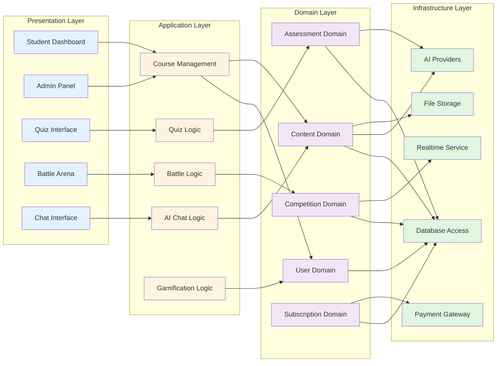
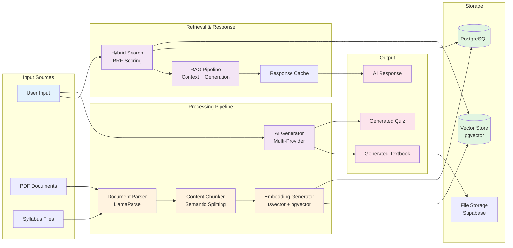
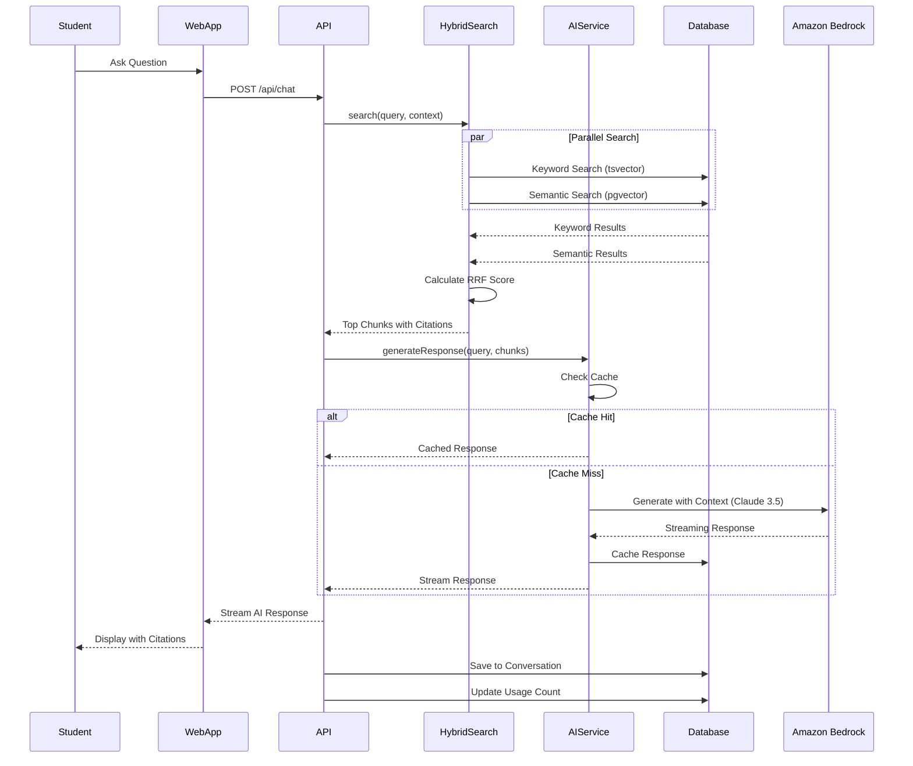
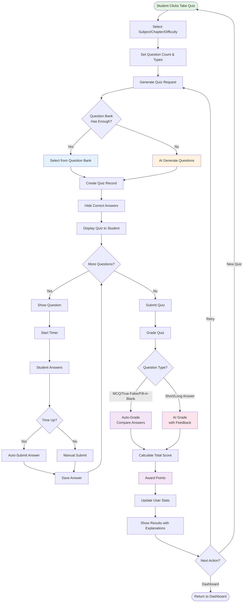
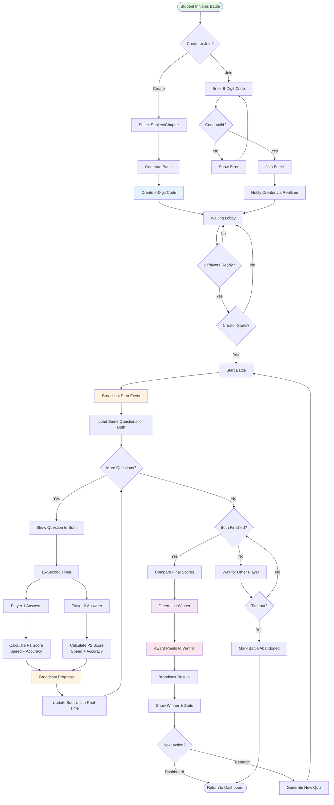
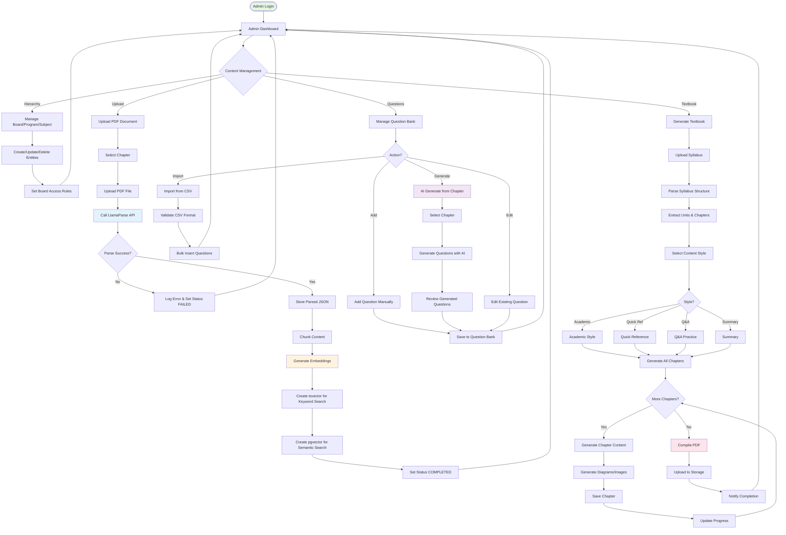
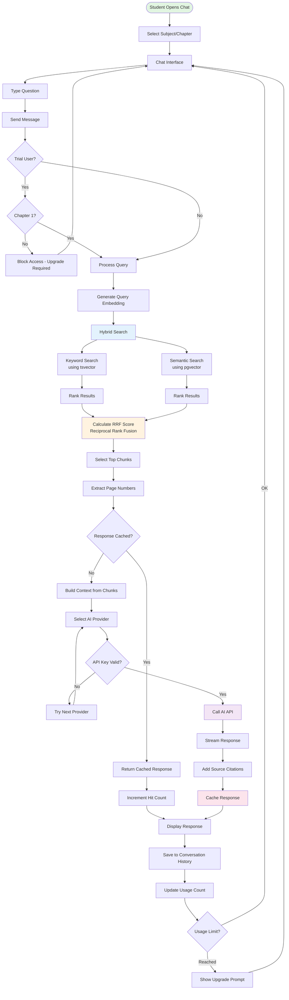

# Zirna IO - AI-Powered Exam Preparation Platform

## Overview

Zirna IO is a comprehensive AI-powered exam preparation SaaS platform designed to serve students across Indian educational boards (CBSE, MBSE, state boards) and competitive examinations (IIT-JEE, NEET, UPSC). The platform combines intelligent content management, RAG-based AI tutoring, gamified learning experiences, and real-time competitive features.

## Key Features

- **Multi-Board Support**: Content organized by Board → Institution → Program → Subject → Chapter
- **AI Chat Tutor**: RAG-based responses with hybrid search (keyword + semantic)
- **Quiz System**: AI-generated and question bank quizzes with auto-grading
- **P2P Battles**: Real-time competitive quiz matches
- **Gamification**: Points, streaks, badges, and leaderboards
- **Trial System**: 3-day free trial for paid courses with limited AI access
- **Textbook Generator**: AI-powered textbook creation from syllabus
- **Payment Integration**: Razorpay for INR subscriptions

## System Architecture

### High-Level Architecture Diagram

### Layered Architecture View

### Data Flow Architecture

### Component Interaction Diagram

## Process Flow Diagrams

### 1. Student Learning Journey

```mermaid
flowchart LR
    Start([Student Visits Platform]) --> Auth{Authenticated?}
    Auth -->|No| Register[Register/Login]
    Auth -->|Yes| Dashboard[Student Dashboard]
    Register --> Dashboard
    
    Dashboard --> Browse[Browse Course Catalog]
    Browse --> Filter[Filter by Board/Program/Subject]
    Filter --> SelectCourse[Select Course]
    
    SelectCourse --> CheckPrice{Course Type?}
    CheckPrice -->|Free| EnrollFree[Enroll Immediately]
    CheckPrice -->|Paid| StartTrial[Start 3-Day Trial]
    
    EnrollFree --> AccessContent[Access Full Content]
    StartTrial --> TrialAccess[Access Chapter 1 + Full Textbook]
    
    TrialAccess --> TrialExpiry{Trial Expired?}
    TrialExpiry -->|No| ContinueTrial[Continue Learning]
    TrialExpiry -->|Yes| Payment{Made Payment?}
    Payment -->|No| Restricted[AI Features Blocked]
    Payment -->|Yes| AccessContent
    ContinueTrial --> AccessContent
    
    AccessContent --> LearningOptions{Choose Activity}
    
    LearningOptions -->|Study| ReadChapter[Read Chapter Content]
    LearningOptions -->|Ask AI| ChatTutor[AI Chat Tutor]
    LearningOptions -->|Practice| TakeQuiz[Take Quiz]
    LearningOptions -->|Compete| JoinBattle[Join/Create Battle]
    LearningOptions -->|Review| StudyMaterials[View Study Materials]
    
    ReadChapter --> TrackProgress[Update Progress]
    TrackProgress --> BackToDash1[Back to Dashboard]
    
    ChatTutor --> HybridSearch[Hybrid Search Context]
    HybridSearch --> AIResponse[Stream AI Response]
    AIResponse --> EarnPoints1[Earn Points]
    
    TakeQuiz --> QuizFlow[Quiz Flow]
    QuizFlow --> QuizResults[View Results]
    QuizResults --> EarnPoints2[Earn Points]
    
    JoinBattle --> BattleFlow[Battle Flow]
    BattleFlow --> BattleResults[View Winner]
    BattleResults --> EarnPoints3[Earn Points]
    
    StudyMaterials --> ViewSummary[Summaries/Flashcards/Mind Maps]
    ViewSummary --> BackToDash2[Back to Dashboard]
    
    EarnPoints1 --> UpdateStreak[Update Daily Streak]
    EarnPoints2 --> UpdateStreak
    EarnPoints3 --> UpdateStreak
    
    UpdateStreak --> CheckBadges{Badge Milestone?}
    CheckBadges -->|Yes| AwardBadge[Award Badge]
    CheckBadges -->|No| UpdateLeaderboard[Update Leaderboard]
    AwardBadge --> UpdateLeaderboard
    
    UpdateLeaderboard --> BackToDash3[Back to Dashboard]
    BackToDash1 --> Dashboard
    BackToDash2 --> Dashboard
    BackToDash3 --> Dashboard
    Restricted --> Dashboard
    
    style Start fill:#e1f5e1
    style Dashboard fill:#e3f2fd
    style AccessContent fill:#fff3e0
    style EarnPoints1 fill:#f3e5f5
    style EarnPoints2 fill:#f3e5f5
    style EarnPoints3 fill:#f3e5f5
    style AwardBadge fill:#fce4ec
```

### 2. Quiz Generation and Taking Flow

### 3. P2P Battle Flow

### 4. Admin Content Management Flow

### 5. AI Chat Tutor Flow with Hybrid Search

### 6. Use Case Diagram

```mermaid
graph TB
    subgraph "Actors"
        Student((Student))
        Admin((Admin))
        Instructor((Instructor))
        System((System))
    end
    
    subgraph "Student Use Cases"
        UC1[Register/Login]
        UC2[Browse Courses]
        UC3[Enroll in Course]
        UC4[Read Chapter Content]
        UC5[Chat with AI Tutor]
        UC6[Take Quiz]
        UC7[Create/Join Battle]
        UC8[View Study Materials]
        UC9[Track Progress]
        UC10[View Leaderboard]
        UC11[Manage Subscription]
    end
    
    subgraph "Admin Use Cases"
        UC12[Manage Content Hierarchy]
        UC13[Upload Documents]
        UC14[Manage Question Bank]
        UC15[Generate Textbooks]
        UC16[Manage API Keys]
        UC17[View Analytics]
        UC18[Manage Users]
    end
    
    subgraph "Instructor Use Cases"
        UC19[Create Courses]
        UC20[Upload Content]
        UC21[Create Quizzes]
        UC22[View Student Progress]
    end
    
    subgraph "System Use Cases"
        UC23[Process Documents]
        UC24[Generate Embeddings]
        UC25[Hybrid Search]
        UC26[Grade Quizzes]
        UC27[Calculate Streaks]
        UC28[Award Badges]
        UC29[Process Payments]
    end
    
    Student --> UC1
    Student --> UC2
    Student --> UC3
    Student --> UC4
    Student --> UC5
    Student --> UC6
    Student --> UC7
    Student --> UC8
    Student --> UC9
    Student --> UC10
    Student --> UC11
    
    Admin --> UC12
    Admin --> UC13
    Admin --> UC14
    Admin --> UC15
    Admin --> UC16
    Admin --> UC17
    Admin --> UC18
    
    Instructor --> UC19
    Instructor --> UC20
    Instructor --> UC21
    Instructor --> UC22
    
    UC13 -.-> UC23
    UC23 -.-> UC24
    UC5 -.-> UC25
    UC6 -.-> UC26
    UC9 -.-> UC27
    UC27 -.-> UC28
    UC11 -.-> UC29
    
    style Student fill:#e1f5e1
    style Admin fill:#ffe0e0
    style Instructor fill:#e0e0ff
    style System fill:#fff3e0
```

## Specification Files

- [Requirements](./requirements.md) - Detailed requirements with user stories and acceptance criteria
- [Design](./design.md) - Technical design, architecture, and correctness properties
- [Tasks](./tasks.md) - Implementation task breakdown

## Getting Started

1. Review the requirements document to understand the functional specifications
2. Study the design document for technical architecture and data models
3. Follow the tasks document for implementation order
4. Each task includes property-based tests to verify correctness

## Technology Stack

- **Frontend**: Next.js 14+, React 18, Tailwind CSS, Shadcn UI
- **Backend**: Next.js API Routes, Server Actions
- **Database**: PostgreSQL with pgvector extension
- **ORM**: Prisma 6.4.1
- **Authentication**: NextAuth.js 4.24
- **Realtime**: Supabase Realtime
- **AI**: Amazon Bedrock Claude 3.5 Sonnet (primary), Google Gemini, OpenAI, Anthropic, OpenRouter (fallback)
- **Document Parsing**: LlamaParse
- **Payments**: Razorpay (INR)
- **Deployment**: Vercel
