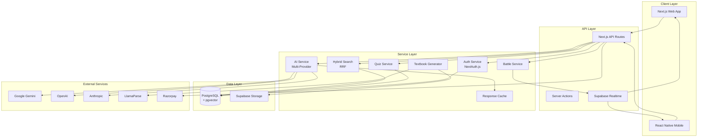
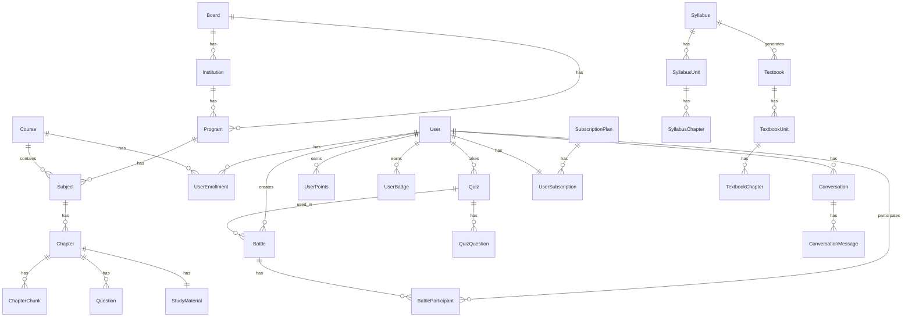

# Design Document: Zirna IO - AI-Powered Exam Preparation Platform

## Overview

Zirna IO is a comprehensive AI-powered exam preparation SaaS platform built with Next.js 14+, designed to serve students across Indian educational boards (CBSE, MBSE, state boards) and competitive examinations (IIT-JEE, NEET, UPSC). The platform combines intelligent content management, RAG-based AI tutoring, gamified learning experiences, and real-time competitive features.

### Key Design Principles

1. **Multi-Board Support**: Board-based content isolation with support for NCERT cross-board sharing
2. **AI-First**: RAG-based responses with hybrid search (keyword + semantic)
3. **Gamification**: Points, streaks, badges, and P2P battles for engagement
4. **Scalability**: Async job processing, caching, and efficient database design
5. **Monetization**: Freemium model with trial periods and Razorpay integration (INR)

## Architecture



## Components and Interfaces

### 1. Content Management System

```typescript
interface ContentHierarchy {
  board: Board;
  institution?: Institution;
  program: Program;
  subject: Subject;
  chapter: Chapter;
}

interface Board {
  id: string;           // 'CBSE', 'MBSE', 'IIT-JEE', 'UPSC'
  name: string;
  type: 'academic' | 'competitive_exam' | 'professional';
  is_active: boolean;
}

interface Chapter {
  id: bigint;
  subject_id: number;
  title: string;
  content_json: JSON;           // LlamaParse output
  accessible_boards: string[];  // Board IDs for NCERT cross-board sharing
  is_global: boolean;           // Accessible to all boards
  processing_status: ChapterStatus;
}


interface ChapterChunk {
  id: bigint;
  chapter_id: bigint;
  chunk_index: number;
  content: string;
  page_number?: number;
  search_vector: tsvector;      // Keyword search
  semantic_vector: vector;       // Semantic search (768 dimensions)
}
```

### 2. Hybrid Search Service

```typescript
interface HybridSearchService {
  search(
    query: string,
    limit: number,
    filters: {
      boardId: string;
      subjectId?: number;
      chapterId?: number;
    }
  ): Promise<HybridSearchResult>;
}

interface HybridSearchResult {
  results: SearchResult[];
  searchMethod: 'hybrid' | 'semantic_fallback' | 'keyword_only' | 'vector_only';
  stats: {
    tsvectorResults: number;
    semanticResults: number;
    finalResults: number;
  };
}

interface SearchResult {
  id: string;
  subject: string;
  title: string;
  content: string;
  rrf_score: number;        // Reciprocal Rank Fusion score
  semantic_rank?: number;
  keyword_rank?: number;
  citation?: {
    pageNumber: number;
    chunkContent: string;
  };
}
```

### 3. AI Service

```typescript
interface AIService {
  generateResponse(
    query: string,
    context: SearchResult[],
    conversationHistory: ChatMessage[]
  ): Promise<AIResponse>;
  
  generateQuiz(config: QuizGenerationConfig): Promise<GeneratedQuiz>;
  
  gradeSubjectiveAnswer(
    question: string,
    userAnswer: string,
    correctAnswer: string
  ): Promise<GradeResult>;
  
  generateStudyMaterials(chapterId: bigint): Promise<StudyMaterial>;
}

interface QuizGenerationConfig {
  subject: string;
  topic: string;
  difficulty: 'easy' | 'medium' | 'hard' | 'exam';
  questionCount: number;
  questionTypes: QuestionType[];
  context: string;
}
```

### 4. Quiz Service

```typescript
interface QuizService {
  generateQuiz(
    userId: number,
    subjectId: number | null,
    chapterId: number | null,
    difficulty: Difficulty,
    questionCount: number,
    questionTypes: QuestionType[],
    useAiFallback: boolean
  ): Promise<Quiz>;
  
  submitQuiz(
    userId: number,
    quizId: string,
    answers: Record<string, any>
  ): Promise<QuizResult>;
}

interface Quiz {
  id: string;
  user_id: number;
  subject_id: number;
  chapter_id?: bigint;
  title: string;
  status: QuizStatus;
  score: number;
  total_points: number;
  questions: QuizQuestion[];
}
```

### 5. Battle Service

```typescript
interface BattleService {
  createBattle(userId: number, quizId: string): Promise<Battle>;
  joinBattle(userId: number, code: string): Promise<Battle>;
  startBattle(battleId: string, userId: number): Promise<Battle>;
  updateProgress(
    battleId: string,
    userId: number,
    score: number,
    questionIndex: number,
    finished: boolean
  ): Promise<BattleParticipant>;
  rematchBattle(battleId: string, newQuizId: string, requesterId: number): Promise<Battle>;
}

interface Battle {
  id: string;
  quiz_id: string;
  code: string;             // 6-digit join code
  status: BattleStatus;
  created_by: number;
  participants: BattleParticipant[];
}

type BattleStatus = 'WAITING' | 'STARTING' | 'IN_PROGRESS' | 'COMPLETED' | 'ABANDONED' | 'EXPIRED';
```

### 6. Gamification Service

```typescript
interface GamificationService {
  awardPoints(userId: number, points: number, reason: string, metadata?: any): Promise<void>;
  calculateStreak(userId: number): Promise<number>;
  checkAndAwardBadges(userId: number, currentStreak: number): Promise<void>;
  getLeaderboard(limit: number): Promise<LeaderboardEntry[]>;
}
```

### 7. Trial Access Service

```typescript
interface TrialAccessService {
  getTrialAccess(
    enrollment: UserEnrollment | null,
    course: Course | null
  ): AccessResult;
  
  checkAIFeatureAccess(
    userId: number,
    chapterId: bigint | null
  ): Promise<{ allowed: boolean; reason?: string }>;
}

interface AccessResult {
  status: 'full_access' | 'trial_active' | 'trial_expired' | 'not_enrolled';
  hasFullAccess: boolean;
  isTrialActive: boolean;
  trialDaysRemaining: number | null;
}
```

### 8. Textbook Generator

```typescript
interface TextbookGenerator {
  parseSyllabus(rawText: string): Promise<ParsedSyllabus>;
  generateChapter(
    chapterId: number,
    options: ChapterGenerationOptions
  ): Promise<GeneratedChapterContent>;
  compilePDF(textbookId: number, chapterIds: number[]): Promise<BookCompilationResult>;
}

type ContentStyle = 'academic' | 'quick_reference' | 'qa_practice' | 'summary' | 'case_study' | 'aptitude_drill';
```


## Data Models

### Entity Relationship Diagram



### Key Data Structures

```typescript
// User and Authentication
interface User {
  id: number;
  username: string;
  email?: string;
  password_hash?: string;
  role: 'admin' | 'instructor' | 'student' | 'institution';
  is_active: boolean;
  last_login?: Date;
}

// Enrollment with Trial
interface UserEnrollment {
  id: number;
  user_id: number;
  course_id: number;
  status: 'active' | 'completed' | 'archived';
  progress: number;           // 0-100
  is_paid: boolean;
  trial_ends_at?: Date;       // 3 days from enrollment
  payment_id?: string;        // Razorpay reference
}

// AI API Key Management
interface AiApiKey {
  id: number;
  provider: Provider;
  label: string;
  api_key_enc: string;        // Encrypted
  active: boolean;
  priority: number;
  success_count: number;
  error_count: number;
  last_used_at?: Date;
}

// Response Cache
interface AiResponseCache {
  id: number;
  cache_key: string;
  query_type: string;
  chapter_id?: bigint;
  subject_id?: bigint;
  question: string;
  response_text: string;
  hit_count: number;
  expires_at: Date;
}

// Usage Tracking
interface UsageTracking {
  id: number;
  user_id: number;
  usage_type: UsageType;
  count: number;
  period_start: Date;
  period_end: Date;
}

type UsageType = 
  | 'file_upload' 
  | 'chat_message' 
  | 'quiz_generation' 
  | 'battle_match' 
  | 'ai_tutor_session' 
  | 'image_generation';
```


## Correctness Properties

*A property is a characteristic or behavior that should hold true across all valid executions of a system—essentially, a formal statement about what the system should do. Properties serve as the bridge between human-readable specifications and machine-verifiable correctness guarantees.*

### Property 1: Board-Based Content Filtering

*For any* board query, the returned chapters SHALL include all chapters where `is_global = true` OR the board_id is in `accessible_boards`, and SHALL exclude all chapters where neither condition is met.

**Validates: Requirements 1.4, 1.5, 1.7**

### Property 2: Chapter Processing State Machine

*For any* chapter, the processing_status SHALL transition only through valid states: PENDING → PROCESSING → (COMPLETED | FAILED), and WHEN status is COMPLETED, content_json SHALL be non-null and parsed_at SHALL be set.

**Validates: Requirements 2.2, 2.5, 2.6**

### Property 3: Chunk Ordering Invariant

*For any* chapter with chunks, concatenating chunk.content ordered by chunk_index SHALL produce a semantically equivalent reconstruction of the original parsed content.

**Validates: Requirements 2.3, 2.7**

### Property 4: Chunk Embedding Completeness

*For any* created chunk, both search_vector (tsvector) and semantic_vector (pgvector) SHALL be non-null.

**Validates: Requirements 2.4**

### Property 5: Hybrid Search RRF Scoring

*For any* search query, the returned results SHALL have rrf_score computed as the sum of reciprocal ranks from both semantic and keyword searches, and results SHALL be ordered by descending rrf_score.

**Validates: Requirements 3.1, 3.2**

### Property 6: Conversation Context Association

*For any* conversation, subject_id SHALL be non-null, and all messages SHALL have role, content, and created_at populated.

**Validates: Requirements 3.5, 3.6**

### Property 7: Source Citation Completeness

*For any* search result with a page_number in chunk metadata, the citation object SHALL include pageNumber matching the chunk's page_number.

**Validates: Requirements 3.7**

### Property 8: Study Material Structure Validity

*For any* generated StudyMaterial, the summary field SHALL contain key_points array, flashcards SHALL be an array of {front, back} objects, and definitions SHALL be an array of {term, definition} objects.

**Validates: Requirements 4.1, 4.2, 4.4**

### Property 9: Mind Map Syntax Validity

*For any* generated mind_map, the content SHALL be valid Mermaid.js syntax that can be parsed without errors.

**Validates: Requirements 4.3**

### Property 10: Question Source Selection Priority

*For any* quiz generation request, IF the Question_Bank contains >= questionCount questions matching the criteria, THEN no AI generation SHALL be invoked; OTHERWISE AI generation SHALL be used as fallback.

**Validates: Requirements 5.1, 5.2**

### Property 11: Quiz Answer Hiding

*For any* quiz returned to the client before submission, all questions SHALL have correct_answer = null and explanation = null.

**Validates: Requirements 5.5**

### Property 12: Objective Question Auto-Grading

*For any* submitted quiz with MCQ, TRUE_FALSE, or FILL_IN_BLANK questions, is_correct SHALL equal (user_answer == correct_answer) using normalized comparison.

**Validates: Requirements 5.6**

### Property 13: Quiz Completion Points Award

*For any* completed quiz with score > 0, a UserPoints record SHALL be created with points equal to the quiz score and reason = 'quiz_completion'.

**Validates: Requirements 5.8, 8.1**

### Property 14: Battle Code Uniqueness

*For any* two battles, their codes SHALL be distinct 6-character strings.

**Validates: Requirements 7.1**

### Property 15: Battle Status State Machine

*For any* battle, status transitions SHALL follow: WAITING → (IN_PROGRESS | EXPIRED | ABANDONED), IN_PROGRESS → (COMPLETED | ABANDONED), and no other transitions are valid.

**Validates: Requirements 7.4, 7.6, 7.8**

### Property 16: Battle Completion Condition

*For any* battle, status SHALL transition to COMPLETED if and only if all participants have finished = true.

**Validates: Requirements 7.6**

### Property 17: Streak Calculation Correctness

*For any* user, calculateStreak SHALL return the count of consecutive days (including today or yesterday) with at least one UserPoints record, and SHALL return 0 if no activity in the last 2 days.

**Validates: Requirements 8.2, 8.3**

### Property 18: Badge Award Idempotence

*For any* user and badge, at most one UserBadge record SHALL exist for that (user_id, badge_id) pair.

**Validates: Requirements 8.5, 8.6**

### Property 19: Trial Period Duration

*For any* enrollment in a paid course, trial_ends_at SHALL be exactly 3 days after enrolled_at.

**Validates: Requirements 9.2**

### Property 20: Trial AI Access Restriction

*For any* user with trial_active status, AI features SHALL be accessible for chapters with chapter_number <= 1 and SHALL be blocked for chapters with chapter_number > 1.

**Validates: Requirements 9.3**

### Property 21: Trial Expiration Access Block

*For any* user with trial_expired status (trial_ends_at < now AND is_paid = false), all AI features SHALL be blocked.

**Validates: Requirements 9.4**

### Property 22: API Key Selection Priority

*For any* AI API call, the system SHALL select the active key with the highest priority for the requested provider.

**Validates: Requirements 11.2**

### Property 23: API Key Failover

*For any* failed AI API call, the system SHALL retry with the next highest priority active key for the same provider.

**Validates: Requirements 11.3**

### Property 24: Syllabus Parsing Structure

*For any* parsed syllabus, the result SHALL contain a units array where each unit has a chapters array, and each chapter has number, title, and subtopics fields.

**Validates: Requirements 12.1**

### Property 25: Usage Limit Enforcement

*For any* user action of a tracked type, IF current period usage count >= plan limit, THEN the action SHALL be rejected.

**Validates: Requirements 14.2, 14.3**

### Property 26: Cache Hit Behavior

*For any* query with an existing non-expired cache entry, the cached response SHALL be returned and hit_count SHALL be incremented.

**Validates: Requirements 15.2, 15.3**

### Property 27: Enrollment Progress Bounds

*For any* enrollment, progress SHALL be in the range [0, 100].

**Validates: Requirements 9.6**


## Error Handling

### AI Service Errors

| Error Type | Handling Strategy |
|------------|-------------------|
| API Key Exhausted | Rotate to next priority key, log error_count |
| Rate Limited | Exponential backoff with jitter, max 3 retries |
| Timeout | 90-second timeout, return partial response if available |
| Invalid Response | Log and retry with different model |
| Context Too Long | Truncate context, prioritize high RRF score chunks |

### Battle Service Errors

| Error Type | Handling Strategy |
|------------|-------------------|
| Battle Not Found | Return 404 with clear message |
| Already Started | Return 400, prevent duplicate joins |
| Unauthorized Start | Only creator can start, return 403 |
| Participant Timeout | Mark as ABANDONED after 5 minutes inactivity |
| Realtime Disconnect | Reconnect with exponential backoff |

### Quiz Service Errors

| Error Type | Handling Strategy |
|------------|-------------------|
| Insufficient Questions | Fall back to AI generation |
| AI Generation Failed | Return error, suggest retry |
| Grading Failed | Store partial results, flag for manual review |
| Duplicate Submission | Return existing results, prevent re-grading |

### Trial Access Errors

| Error Type | Handling Strategy |
|------------|-------------------|
| Not Enrolled | Return 403 with enrollment prompt |
| Trial Expired | Return 403 with upgrade prompt |
| Chapter Restricted | Return 403 with specific chapter access message |

## Testing Strategy

### Unit Testing

Unit tests focus on specific examples, edge cases, and error conditions:

- **Content Hierarchy**: Test CRUD operations for each entity level
- **Chunk Processing**: Test chunking algorithm with various content sizes
- **Quiz Grading**: Test each question type's grading logic
- **Streak Calculation**: Test edge cases (no activity, gaps, timezone boundaries)
- **Trial Access**: Test all status combinations and chapter restrictions

### Property-Based Testing

Property tests verify universal properties across all inputs using a property-based testing library (e.g., fast-check for TypeScript):

**Configuration**: Minimum 100 iterations per property test

**Test Annotations**: Each test must reference its design property:
```typescript
// Feature: ai-exam-prep-platform, Property 1: Board-Based Content Filtering
```

**Property Test Categories**:

1. **Data Integrity Properties** (Properties 3, 4, 6, 24, 27)
   - Generate random content and verify structural invariants
   - Test with edge cases: empty content, maximum sizes, special characters

2. **State Machine Properties** (Properties 2, 15, 16)
   - Generate random sequences of state transitions
   - Verify only valid transitions are allowed

3. **Search Properties** (Properties 1, 5, 7)
   - Generate random queries and verify result ordering
   - Test with various filter combinations

4. **Access Control Properties** (Properties 19, 20, 21)
   - Generate random enrollment states and verify access decisions
   - Test boundary conditions around trial expiration

5. **Idempotence Properties** (Properties 18, 26)
   - Verify repeated operations produce same result
   - Test cache behavior with identical queries

6. **Ordering Properties** (Properties 10, 22, 23)
   - Verify priority-based selection
   - Test failover sequences

### Integration Testing

- **AI Provider Integration**: Test with mocked providers
- **Supabase Realtime**: Test battle event broadcasting
- **Razorpay Webhooks**: Test payment flow completion (INR)
- **LlamaParse**: Test document parsing pipeline

### End-to-End Testing

- **Student Learning Flow**: Enrollment → Study → Quiz → Battle
- **Admin Content Flow**: Upload → Parse → Publish
- **Textbook Generation**: Syllabus → Generate → Compile PDF
